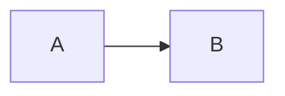

# react
## 状态管理
1.  mobx

2.  redux

## 生命周期& Hooks

1. 新增 & **废弃**
> 饮用内容
2. 自定义Hooks 
****

## 性能优化

1. 优化方面

 - 图片引入 
 - 图片引入 [照片](~@alias/longze.jpg)
 - [An image](~@image/image.png "链接标题阿")

 姓名|年龄|性别
 :--|---|---
张三|22|男


```flow
    st=>start: 开始
    op=>operation: My Operation
    cond=>condition: Yes or No?
    e=>end
    st->op->cond
    cond(yes)->e
    cond(no)->op
```




